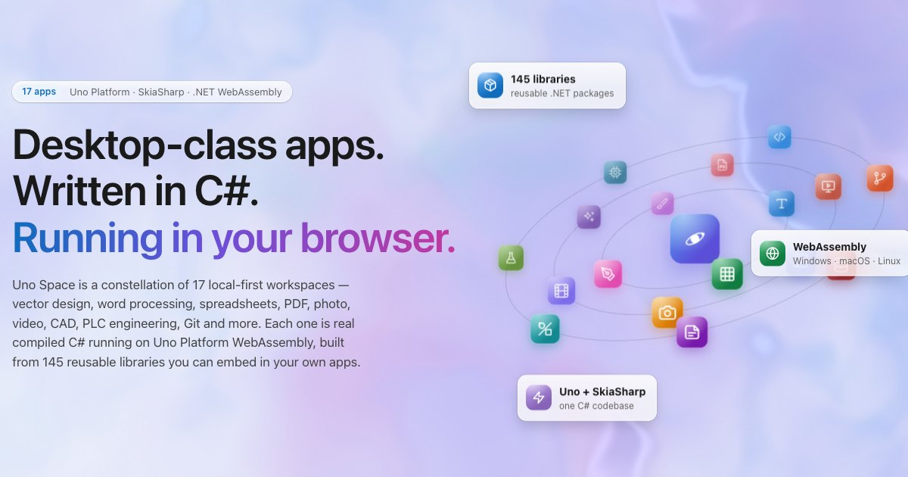

# Uno Space

**Seventeen desktop‑class workspaces, written in C#, running in your browser.**

[](https://github.com/wieslawsoltes/UnoSpace/actions/workflows/ci.yml)
[](https://github.com/wieslawsoltes/UnoSpace/actions/workflows/pages.yml)
[](LICENSE)

**[Open the site →](https://wieslawsoltes.github.io/UnoSpace/)**



Uno Space is the showcase for a family of local‑first applications built with
[Uno Platform](https://platform.uno), SkiaSharp and .NET WebAssembly. Every app is
the real compiled C# application — the same code runs in the browser and natively
on Windows, macOS and Linux.

| Domain | Apps |
|---|---|
| Design & Illustration | [VectorSpace](https://github.com/wieslawsoltes/VectorSpace) · [ArtSpace](https://github.com/wieslawsoltes/ArtSpace) |
| Documents & Office | [TextSpace](https://github.com/wieslawsoltes/TextSpace) · [GridSpace](https://github.com/wieslawsoltes/GridSpace) · [PdfSpace](https://github.com/wieslawsoltes/PdfSpace) · [PresentationSpace](https://github.com/wieslawsoltes/PresentationSpace) |
| Photo, Video & Motion | [ImageSpace](https://github.com/wieslawsoltes/ImageSpace) · [LightSpace](https://github.com/wieslawsoltes/LightSpace) · [VideoSpace](https://github.com/wieslawsoltes/VideoSpace) · [EffectsSpace](https://github.com/wieslawsoltes/EffectsSpace) |
| Engineering & Science | [CadSpace](https://github.com/wieslawsoltes/CadSpace) · [LabSpace](https://github.com/wieslawsoltes/LabSpace) · [ControlSpace](https://github.com/wieslawsoltes/ControlSpace) |
| Developer Tools | [CodeSpace](https://github.com/wieslawsoltes/CodeSpace) · [GitSpace](https://github.com/wieslawsoltes/GitSpace) |
| Data & Knowledge | [DataSpace](https://github.com/wieslawsoltes/DataSpace) · [NoteSpace](https://github.com/wieslawsoltes/NoteSpace) |

## What the site contains

- **Home** — an interactive orbit of all apps, category filters and search, the shared
  Uno/Skia/.NET stack, the recurring layered architecture, and infographics generated
  from the source repositories (codebase size, libraries per layer, shared NuGet
  foundations, domain breakdown).
- **Project pages** (`/projects/<app>/`) — highlights, a tabbed feature tour, an
  **integrated playground** that boots the live GitHub Pages build inline (viewport
  presets, fullscreen, guided tour with saved progress, keyboard cheat sheet), an
  interactive **project dependency graph** and cards for every reusable package,
  architecture layers, code samples, file formats, CI pipelines with live status,
  toolchain, honest limitations and documentation links.
- **Playground hub** (`/playground/`) — switch between all apps in one embedded player.
- **Package explorer** (`/packages/`) — every reusable library, filterable by layer, app
  and capability.
- **Compare** (`/compare/`) — a size × capability bubble chart and a sortable table.
- **`data/apps.json`** — the combined catalog as machine‑readable JSON.

The site is plain HTML, CSS and JavaScript generated by a dependency‑free Node script —
no framework, no client bundle. The visual language follows Microsoft Fluent 2:

- **Wallpaper** — a live "bloom" field rendered on the GPU (`site/assets/js/fluent-bg.js`:
  WebGPU, falling back to WebGL2, then CSS). It runs at reduced resolution and 20–30 fps,
  pauses when the tab is hidden or the page is prerendering, and takes each app's colours
  on its project page.
- **Materials** — acrylic cards (tint, luminosity sheen, grain, glass edge) with Fluent
  *Reveal* pointer light; real backdrop blur only where surfaces float over sharp content
  (navigation, flyouts, playground chrome, hero cards); Mica for long‑lived chrome.
- **Motion** — Fluent easing, cross‑document View Transitions (app icon and screenshot
  morph into the app page), scroll‑driven animations, and Speculation Rules prerendering
  on hover.
- Light and dark themes follow the OS until the visitor picks one.

## How it works

```
data/catalog.json          app list, categories, accent colours
data/projects/<app>.json   curated content (features, packages, tours…)  — see data/SCHEMA.md
data/generated/<app>.json  computed facts: csproj graph, LOC, NuGet, workflows, docs
site/assets/               CSS + JS (GPU wallpaper, orbit, charts, playground, explorers)
site/static/shots/         live screenshots of each deployed app
scripts/sync.mjs           clones every app repo and regenerates data/generated
scripts/build.mjs          renders dist/ (pages, sitemap, apps.json, 404)
scripts/check.mjs          validates data, links, anchors and duplicate ids
scripts/shots.mjs          captures live app screenshots with Playwright
scripts/og.mjs             renders the social preview image
```

## Develop

Requires Node.js 20+.

```bash
npm ci
npm run build       # render dist/ from committed data
npm test            # validate data and every internal link
npm run serve       # http://localhost:4173/UnoSpace/
```

Refresh data and images from the source repositories:

```bash
npm run sync                         # clone into .cache/repos and re-extract metrics
npx playwright install chromium
npm run shots                        # or: npm run shots -- vectorspace gridspace
npm run og                           # needs `npm run serve` running
```

To add an app: append it to `data/catalog.json`, write `data/projects/<slug>.json`
following [data/SCHEMA.md](data/SCHEMA.md), then run `npm run sync`, `npm run shots -- <slug>`
and `npm run build`.

## CI & deployment

| Workflow | Trigger | What it does |
|---|---|---|
| **CI** | every push & PR | syntax checks, builds from committed data, validates links/anchors, smoke‑tests the server, uploads the site artifact |
| **Pages** | push to `main`, daily, after screenshot refresh, manual | syncs live metrics from all 17 repositories (falls back to committed data), builds, validates, deploys to GitHub Pages and verifies the live `build-info.json` |
| **Refresh screenshots** | weekly, manual | boots every live app in Chromium, captures new screenshots and the social image, commits changes (which redeploys Pages) |

## License

MIT for the site source. Each showcased application carries its own license in its
repository. Product names referenced for comparison belong to their owners.
